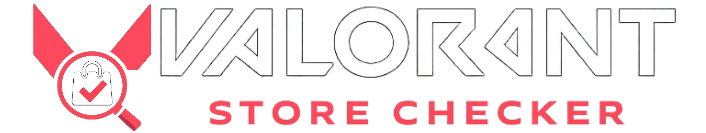

<p align="center">
  
</p>

# Valorant Store Checker

A premium Next.js application to check your daily Valorant store, Night Market, and bundles without launching the game.

## Features

- **Daily Store**: View your 4 daily skins with prices.
- **Night Market**: Check your Night Market discounts.
- **Bundle Info**: See current detailed bundle info and pricing.
- **Secure Auth**: Login securely via Riot ID.

## Getting Started

1. **Install Dependencies**:

   ```bash
   npm install
   ```

2. **Run Development Server**:

   ```bash
   npm run dev
   ```

3. **Open Application**:
   Navigate to [http://localhost:3000](http://localhost:3000).

## Tech Stack

- **Framework**: Next.js 15
- **Styling**: Tailwind CSS
- **Authentication**: Custom Riot Auth implementation
